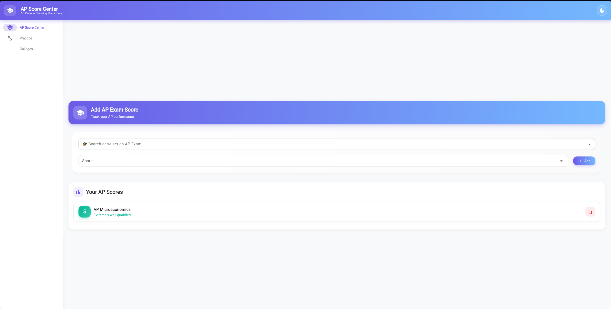

# UniPrep

College Prep App that takes the User's AP Scores and prospective schools to display which AP Scores are accepted for credit at colleges on the user's College List. UniPrep also features an SAT Question of the Day to help users prepare for standardized testing. 

# Getting Started

To access the site use https://uni-prep-7lba.vercel.app

To run locally:

# 1. Clone the repository
git clone https://github.com/breeendon/uni_prep.git
cd uni_prep

# 2. Run the development server
npm run dev

# 3. Use the app!
